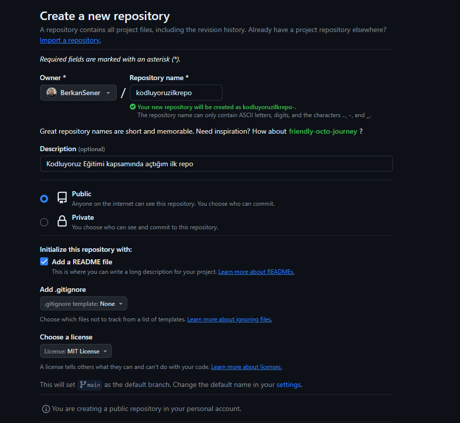
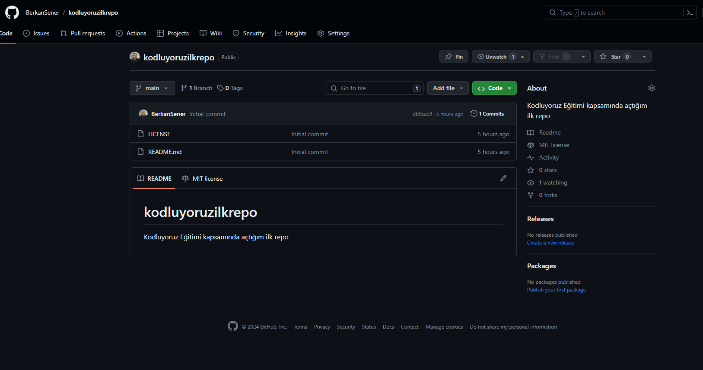

# Kodluyoruz İlk Repo

Bu repo [Kodluyoruz](https://kodluyoruz.org/)  Front-End Eğitiminde oluşturduğum ilk repo. İçerisinde bir adet README dosyası, bir adet de index.html barındırıyor. Repo oluşturma :  

İlk repom :  
  
# Installation  
Öncelikle projeyi clone'layalım.  
```
git clone https://github.com/BerkanSener/kodluyoruzilkrepo.git
```
# Usage
Projeyi clonle'ladım. Readme.md dosyasını düzenlemek için Visual Studio Code programında projemi açtım. Terminalimde repo dizinime gidiyorum :  
```
cd kodluyoruzilkrepo
code .
```
Readme dosyamı düzenledikten sonra repoyu pushlayabilirim.